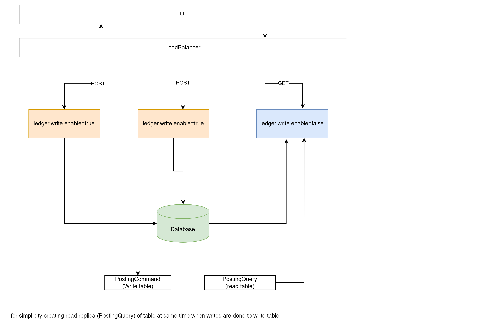
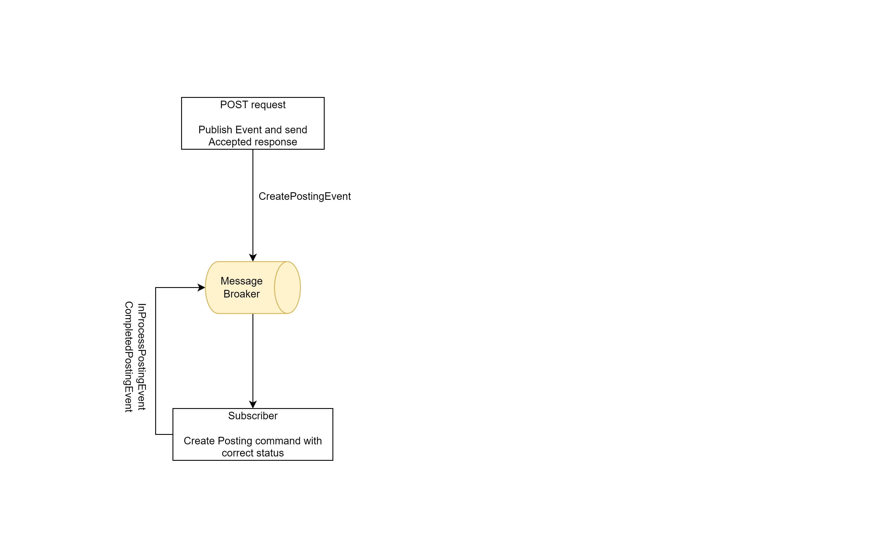
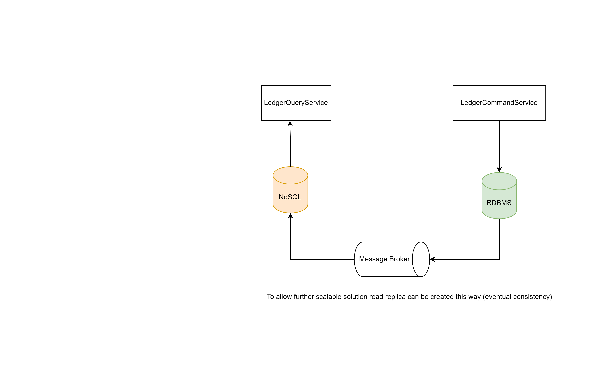

## Current Solution

With `ledger.write.enabled` property we can set to run the application in READ or WRITE mode, allowing the ability to scale the system independently.

Scheduler used to populate data in wallet_ledger(READ) table. Reconciliation done daily for each wallet.

* DB - Postgres
* MessageBroker - RabbitMq

### API documentation
* http://localhost:8080/swagger-ui/index.html

## Improved Solution

## To run application
* uses docker compose feature of spring boot, so docker containers for dba nd mq are started automatically
* Update property `ledger.write.enabled` to ensure REad/write mode
* update server.port for running mutiple instances of application
* tables will be created at server start up (just for dev)
* [init.sql](./src/main/resources/init.sql) for postgres db setup
* [data.sql](./src/main/resources/data.sql) this script to be executed after db container is up and running

## Improvements 

* Transaction Outbox pattern to avoid dual writes
* Load balancing and more
* Optimistic concurrency -> before actually transferring balance
* Read part of application can use NOSql db and can be populated asynchronously using Mq
* Scheduler can be separate service/ or even AWS lambda
* Cache implementation for reconciled data 
* POST API can be updated to send back URL to check progress.
* Validations 
* Auditing and monitoring
* Authentication and authorization

## TODO 
Client of the ledger should be able to change to postings it has done before

Approach can be to get the related postings using correlationId and verify the Postings status, if it is CLEARED it cannot be changed/reverted. Updates allowed only if the posting is in PENDING status.
In the event log add and entry for update request and corresponding result of it i.e. whether it was successful or not. 

